# 📋 KerjainAjaDulu — Aplikasi Manajemen Tugas & Kolaborasi Tim

> Aplikasi berbasis web modern untuk mengelola tugas proyek dan kolaborasi tim menggunakan metode visual **Kanban Board**. Dibangun menggunakan framework **Laravel 13** dengan desain responsif dan interaktif.


---

## 📑 Daftar Isi

- [Fitur Utama](#-fitur-utama)
- [Tech Stack](#️-tech-stack)
- [Struktur Folder](#-struktur-folder)
- [Skema Database](#-skema--rancangan-database)
- [Dokumentasi Screenshot](#-dokumentasi--screenshot-aplikasi)
- [Cara Instalasi](#-cara-instalasi--menjalankan-proyek-secara-lokal)
- [Daftar Routes](#-daftar-routes-aplikasi)
- [Kontribusi](#-kontribusi)
- [Lisensi](#-lisensi)

---

## 🚀 Fitur Utama

| Fitur | Deskripsi |
|---|---|
| 📌 **Project Board (Kanban)** | Kelola tugas dengan 4 kolom status: *Todo*, *In Progress*, *Review*, *Done* |
| 🔥 **Prioritas Tugas** | Tandai tugas dengan prioritas *Tinggi*, *Sedang*, atau *Rendah* |
| 🔍 **Pencarian & Filter** | Cari tugas berdasarkan kata kunci, status, prioritas, atau kategori secara dinamis |
| 👥 **Manajemen Tim** | Tambahkan anggota, tetapkan tugas, dan kelola peran masing-masing anggota |
| ⏰ **Tracker Deadline** | Pantau batas waktu (*due date*) penyelesaian tugas agar tetap tepat waktu |
| 📊 **Dashboard Progress** | Grafik & statistik visual performa kerja tim dan status tugas terkini |
| 💬 **Kolom Komentar** | Diskusi tim secara langsung di dalam detail tugas |
| 🗄️ **Arsip Tugas** | Arsipkan tugas selesai dan pulihkan (*restore*) kapan pun dibutuhkan |
| 👤 **Manajemen Akun** | Edit profil, ubah password, dan sesuaikan pengaturan notifikasi |

---

## 🛠️ Tech Stack

| Lapisan | Teknologi |
|---|---|
| **Backend** | Laravel 13 (PHP 8.3+) |
| **Frontend** | HTML5, Vanilla CSS3 (Responsive), JavaScript Modern |
| **CSS Framework** | Tailwind CSS v4 (via Vite plugin) |
| **Database** | MySQL / SQLite |
| **Build Tool** | Vite 8 |
| **Auth** | Laravel UI (laravel/ui) |
| **Templating** | Blade (Laravel built-in) |

---

## 📁 Struktur Folder

```
TugasAkhir/
│
├── app/
│   ├── Http/
│   │   └── Controllers/
│   │       ├── AuthController.php         # Login & Register
│   │       ├── TaskController.php         # CRUD Tugas & Kanban
│   │       ├── CommentController.php      # Komentar Tugas
│   │       ├── DashboardController.php    # Statistik & Progress
│   │       ├── TeamController.php         # Manajemen Tim
│   │       ├── SettingsController.php     # Pengaturan Aplikasi
│   │       ├── AccountController.php      # Profil Pengguna
│   │       └── NotificationController.php # Notifikasi
│   │
│   └── Models/
│       ├── User.php                       # Model Pengguna
│       ├── Task.php                       # Model Tugas
│       ├── Comment.php                    # Model Komentar
│       └── UserSetting.php               # Model Pengaturan User
│
├── database/
│   ├── migrations/                        # Migrasi skema database
│   ├── factories/                         # Factory untuk seeding
│   └── seeders/                           # Data awal (seeder)
│
├── resources/
│   ├── views/
│   │   ├── layouts/                       # Layout utama (master template)
│   │   ├── auth/                          # Halaman Login & Register
│   │   ├── tasks/                         # Board, Detail, Form Tugas
│   │   ├── dashboard/                     # Halaman Progress & Statistik
│   │   ├── team/                          # Halaman Tim
│   │   ├── account/                       # Halaman Akun
│   │   ├── settings/                      # Halaman Pengaturan
│   │   ├── notifications/                 # Halaman Notifikasi
│   │   └── landing.blade.php              # Halaman Utama (Landing Page)
│   │
│   ├── css/                               # Aset CSS sumber
│   └── js/                                # Aset JavaScript sumber
│
├── public/
│   ├── css/                               # CSS yang telah dikompilasi
│   │   ├── layout.css
│   │   ├── landing.css
│   │   ├── responsive.css
│   │   └── pages/
│   │       ├── pages.css
│   │       └── auth.css
│   └── screenshots/                       # Screenshot aplikasi (opsional)
│
├── routes/
│   └── web.php                            # Definisi semua route web
│
├── .env.example                           # Template konfigurasi environment
├── composer.json                          # Dependensi PHP
├── package.json                           # Dependensi Node.js
└── vite.config.js                         # Konfigurasi Vite
```

---

## 📋 Skema & Rancangan Database

Berikut adalah struktur tabel database untuk aplikasi **KerjainAjaDulu**:

### Hubungan Entitas (ERD)

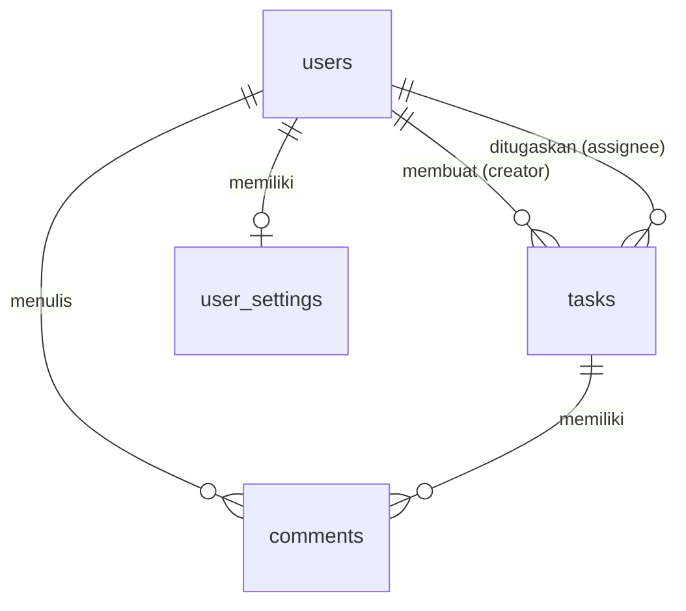

### 📷 Screenshot Struktur & Rancangan Database

Berikut adalah tangkapan layar rancangan struktur tabel pada database `db_laravel_13` di phpMyAdmin:

#### 1. Struktur Tabel `users`
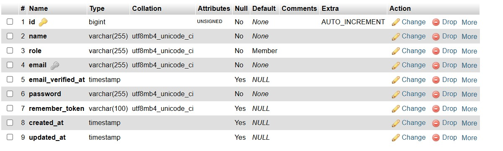

#### 2. Struktur Tabel `tasks`
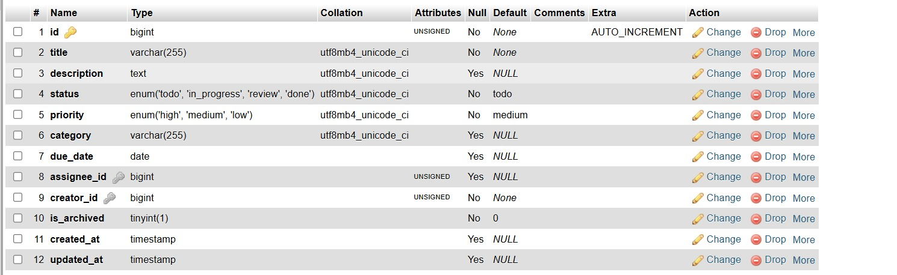

#### 3. Struktur Tabel `comments`
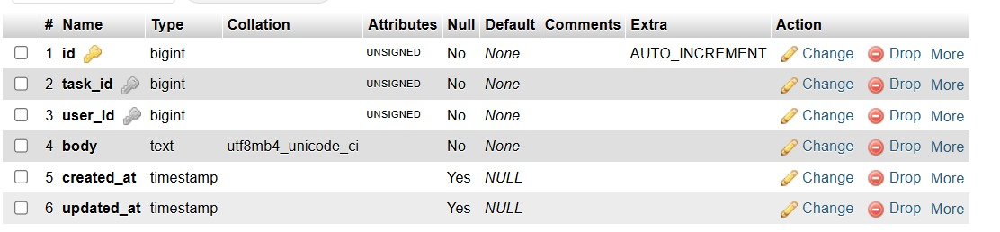

#### 4. Struktur Tabel `user_settings`
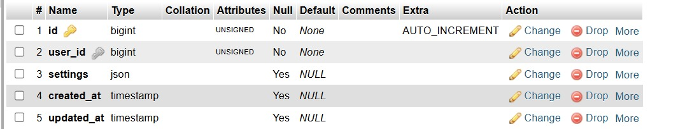

---

### 1. Tabel: `users`
Tabel untuk menyimpan data autentikasi dan informasi pengguna.

| Nama Kolom | Tipe Data | Keterangan |
| --- | --- | --- |
| `id` | BigInt (PK, Auto Increment) | ID unik untuk setiap user |
| `name` | String (255) | Nama lengkap user |
| `role` | String (255) | Peran user (Default: `'Member'`) |
| `email` | String (255) | Email unik untuk login |
| `email_verified_at` | Timestamp (Nullable) | Waktu email diverifikasi |
| `password` | String (255) | Hash password user |
| `remember_token` | String (100) | Token remember-me |
| `created_at` | Timestamp | Waktu pembuatan akun |
| `updated_at` | Timestamp | Waktu pembaruan akun |

### 2. Tabel: `tasks`
Tabel untuk menyimpan detail tugas/task proyek.

| Nama Kolom | Tipe Data | Keterangan |
| --- | --- | --- |
| `id` | BigInt (PK, Auto Increment) | ID unik task |
| `title` | String (255) | Judul task |
| `description` | Text (Nullable) | Deskripsi lengkap task |
| `status` | Enum (`'todo'`, `'in_progress'`, `'review'`, `'done'`) | Status pengerjaan task (Default: `'todo'`) |
| `priority` | Enum (`'high'`, `'medium'`, `'low'`) | Tingkat prioritas task (Default: `'medium'`) |
| `category` | String (255, Nullable) | Kategori task |
| `due_date` | Date (Nullable) | Batas waktu penyelesaian |
| `assignee_id` | BigInt (FK to `users`, Nullable) | Anggota tim yang ditugaskan |
| `creator_id` | BigInt (FK to `users`) | User pembuat task |
| `is_archived` | Boolean | Status pengarsipan task (Default: `false`) |
| `created_at` | Timestamp | Waktu pembuatan task |
| `updated_at` | Timestamp | Waktu pembaruan task |

### 3. Tabel: `comments`
Tabel untuk menyimpan komentar dan diskusi pada setiap tugas.

| Nama Kolom | Tipe Data | Keterangan |
| --- | --- | --- |
| `id` | BigInt (PK, Auto Increment) | ID unik komentar |
| `task_id` | BigInt (FK to `tasks`) | ID task tujuan komentar |
| `user_id` | BigInt (FK to `users`) | ID penulis komentar |
| `body` | Text | Isi komentar |
| `created_at` | Timestamp | Waktu penulisan komentar |
| `updated_at` | Timestamp | Waktu pembaruan komentar |

### 4. Tabel: `user_settings`
Tabel untuk preferensi atau pengaturan kustom per user.

| Nama Kolom | Tipe Data | Keterangan |
| --- | --- | --- |
| `id` | BigInt (PK, Auto Increment) | ID unik pengaturan |
| `user_id` | BigInt (FK to `users`) | ID user pemilik pengaturan |
| `settings` | JSON (Nullable) | Data pengaturan berformat JSON |
| `created_at` | Timestamp | Waktu pembuatan |
| `updated_at` | Timestamp | Waktu pembaruan |

---

## 📸 Dokumentasi & Screenshot Aplikasi

> 📁 Simpan screenshot di folder `public/screenshots/` dan perbarui path gambar di bawah ini sesuai file yang ada.

### 1. Halaman Utama (Landing Page)
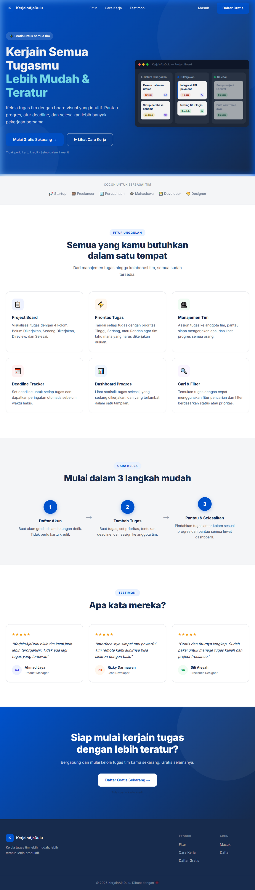
*Tampilan awal yang memperkenalkan fitur-fitur utama aplikasi KerjainAjaDulu.*

### 2. Halaman Login
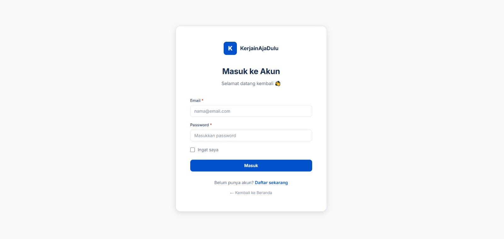
*Form autentikasi masuk bagi pengguna terdaftar.*

### 3. Halaman Register
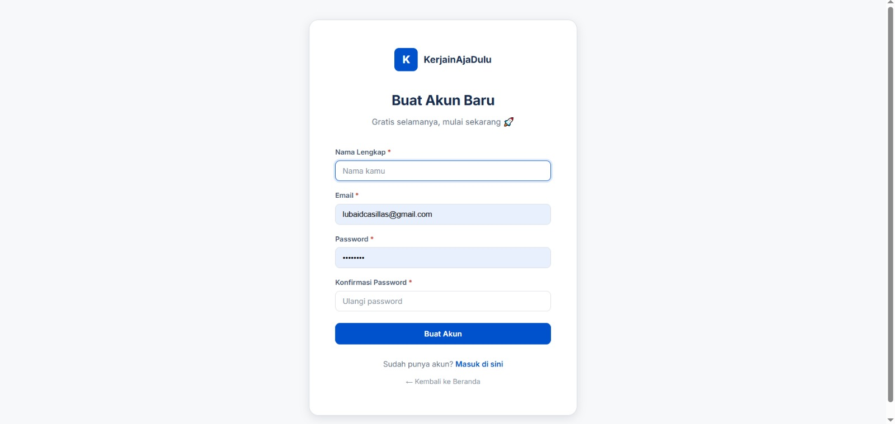
*Pendaftaran akun tim baru secara cepat.*

### 4. Project Board (Kanban Layout)
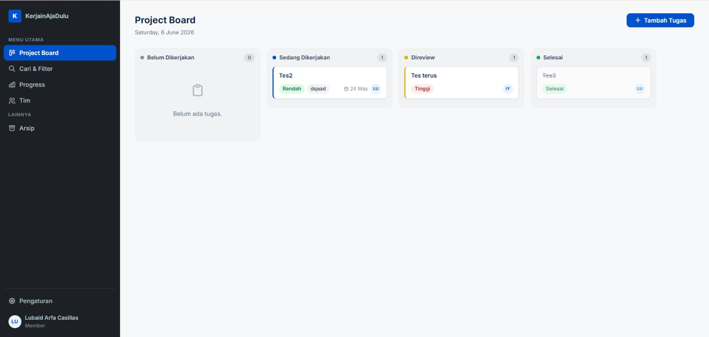
*Tampilan utama pengelolaan tugas dengan kolom interaktif.*

### 5. Detail Tugas & Komentar
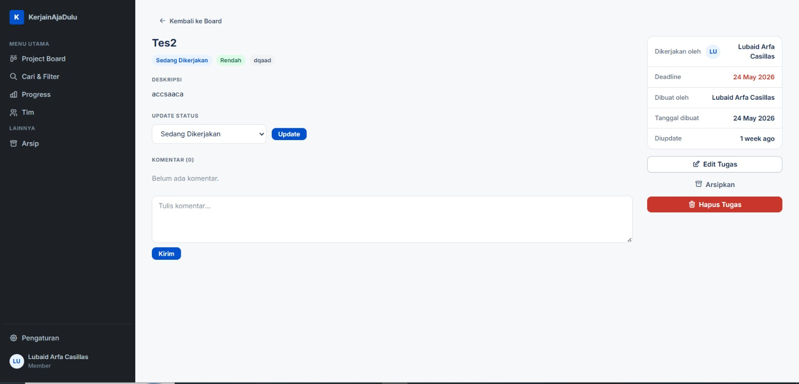
*Halaman detail informasi tugas serta diskusi tim.*

### 6. Tambah Tugas Baru
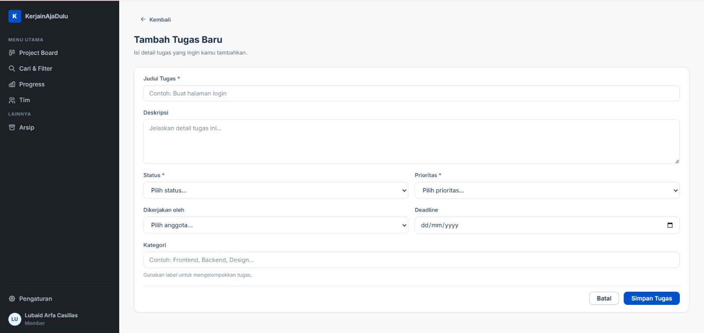
*Halaman form tambah tugas baru.*

### 7. Cari & Filter Tugas
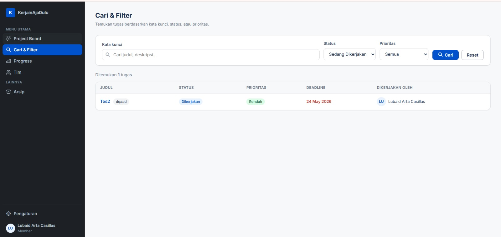
*Pencarian tugas dan penyaringan berdasarkan status, kategori, atau prioritas.*

### 8. Statistik Progress Tim
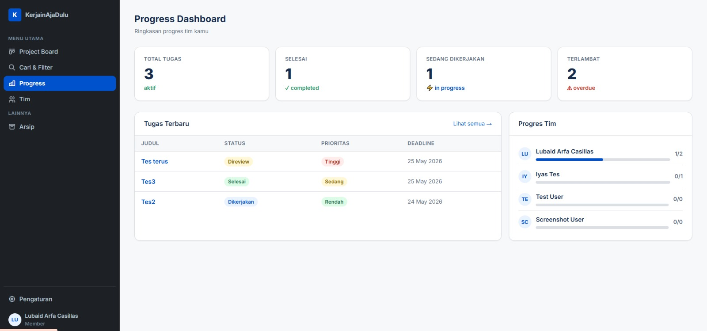
*Grafik dan visualisasi data performa tugas.*

### 9. Halaman Tim
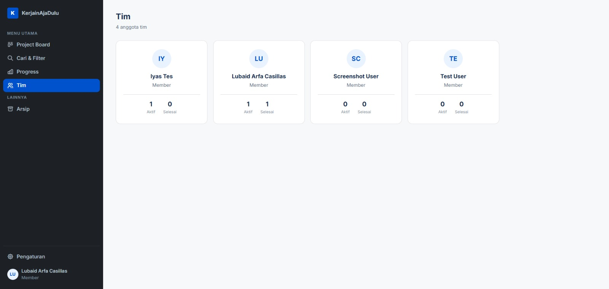
*Halaman manajemen dan daftar anggota tim.*

### 10. Arsip Tugas
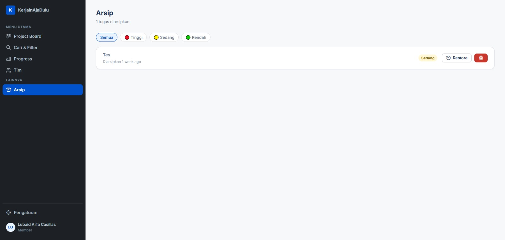
*Halaman daftar tugas-tugas yang telah diarsipkan.*

### 11. Halaman Pengaturan
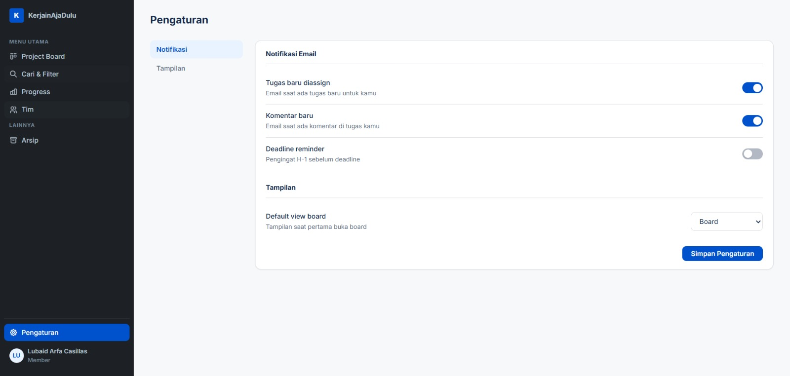
*Halaman penyesuaian preferensi pengguna.*

### 12. Halaman Akun
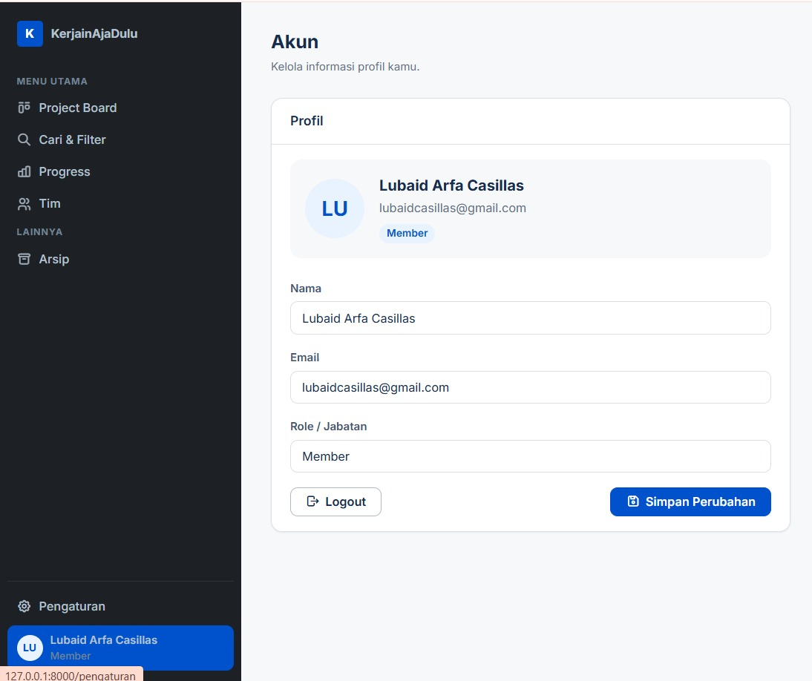
*Halaman profil akun pengguna.*

---

## 🚀 Cara Instalasi & Menjalankan Proyek secara Lokal

### Prasyarat

Pastikan sudah terpasang:

- **PHP** >= 8.3
- **Composer** >= 2.x
- **MySQL** / MariaDB (atau gunakan Laragon/XAMPP)
- **Node.js** >= 18.x & **NPM**

### Langkah-langkah

**1. Clone repositori proyek ini**
```bash
git clone https://github.com/USERNAME/KerjainAjaDulu.git
cd KerjainAjaDulu
```

**2. Instal Dependensi PHP (Composer)**
```bash
composer install
```

**3. Salin & Atur File Konfigurasi Environment**
```bash
cp .env.example .env
```
Edit file `.env` dan sesuaikan konfigurasi database:
```env
APP_NAME=KerjainAjaDulu
APP_URL=http://localhost

DB_CONNECTION=mysql
DB_HOST=127.0.0.1
DB_PORT=3306
DB_DATABASE=kerjainajadulu
DB_USERNAME=root
DB_PASSWORD=
```

**4. Generate Application Key**
```bash
php artisan key:generate
```

**5. Jalankan Migrasi Database**
```bash
php artisan migrate
```

*(Opsional) Jalankan seeder untuk data awal:*
```bash
php artisan db:seed
```

**6. Instal Dependensi Frontend (NPM)**
```bash
npm install
```

**7. Compile Aset Frontend**

Untuk mode *development* (dengan hot-reload):
```bash
npm run dev
```

Untuk mode *production* (build final):
```bash
npm run build
```

**8. Jalankan Development Server**
```bash
php artisan serve
```
Buka **http://127.0.0.1:8000** di browser Anda. ✅

---

### ⚡ Shortcut: Setup Satu Perintah

Jika ingin menjalankan semua langkah setup sekaligus (setelah `.env` dikonfigurasi):
```bash
composer setup
```

Untuk menjalankan semua service sekaligus (server, queue, log watcher, dan Vite):
```bash
composer dev
```

---

## 🗺️ Daftar Routes Aplikasi

### Public Routes

| Method | URI | Nama Route | Keterangan |
|--------|-----|------------|------------|
| `GET` | `/` | `landing` | Halaman utama (Landing Page) |

### Guest Routes (Belum Login)

| Method | URI | Nama Route | Keterangan |
|--------|-----|------------|------------|
| `GET` | `/login` | `login` | Tampilkan form login |
| `POST` | `/login` | `login.post` | Proses autentikasi login |
| `GET` | `/register` | `register` | Tampilkan form registrasi |
| `POST` | `/register` | `register.post` | Proses pendaftaran akun |

### Authenticated Routes (Butuh Login)

#### 🔐 Autentikasi
| Method | URI | Nama Route | Keterangan |
|--------|-----|------------|------------|
| `POST` | `/logout` | `logout` | Proses logout |

#### ✅ Manajemen Tugas
| Method | URI | Nama Route | Keterangan |
|--------|-----|------------|------------|
| `GET` | `/board` | `tasks.index` | Kanban board utama |
| `GET` | `/tugas/tambah` | `tasks.create` | Form tambah tugas baru |
| `POST` | `/tugas` | `tasks.store` | Simpan tugas baru |
| `GET` | `/tugas/cari` | `tasks.search` | Pencarian & filter tugas |
| `GET` | `/tugas/arsip` | `tasks.archive` | Daftar tugas yang diarsipkan |
| `GET` | `/tugas/{task}` | `tasks.show` | Detail tugas |
| `GET` | `/tugas/{task}/edit` | `tasks.edit` | Form edit tugas |
| `PUT` | `/tugas/{task}` | `tasks.update` | Perbarui data tugas |
| `DELETE` | `/tugas/{task}` | `tasks.destroy` | Hapus tugas |
| `PUT` | `/tugas/{task}/arsip` | `tasks.archive-task` | Arsipkan tugas |
| `PUT` | `/tugas/{task}/restore` | `tasks.restore` | Pulihkan tugas dari arsip |

#### 💬 Komentar
| Method | URI | Nama Route | Keterangan |
|--------|-----|------------|------------|
| `POST` | `/tugas/{task}/komentar` | `tasks.comments.store` | Tambah komentar pada tugas |

#### 📊 Dashboard
| Method | URI | Nama Route | Keterangan |
|--------|-----|------------|------------|
| `GET` | `/progress` | `dashboard` | Halaman statistik & progress |

#### 👥 Tim
| Method | URI | Nama Route | Keterangan |
|--------|-----|------------|------------|
| `GET` | `/tim` | `team.index` | Daftar anggota tim |

#### ⚙️ Pengaturan & Akun
| Method | URI | Nama Route | Keterangan |
|--------|-----|------------|------------|
| `GET` | `/pengaturan` | `settings` | Halaman pengaturan |
| `PUT` | `/pengaturan` | `settings.update` | Simpan pengaturan |
| `GET` | `/akun` | `account` | Halaman profil akun |
| `PUT` | `/akun` | `account.update` | Perbarui profil akun |

---

## 🤝 Kontribusi

Proyek ini dibuat sebagai **Tugas Akhir**. Namun, saran dan masukan tetap sangat diterima!

1. Fork repositori ini
2. Buat branch fitur baru: `git checkout -b fitur/nama-fitur`
3. Commit perubahan: `git commit -m 'Tambah fitur baru'`
4. Push ke branch: `git push origin fitur/nama-fitur`
5. Buat Pull Request

---

## 📄 Lisensi

Proyek ini menggunakan lisensi **MIT**. Lihat file [LICENSE](LICENSE) untuk informasi lebih lanjut.

---

<div align="center">

Dibuat menggunakan **Laravel 13** — *KerjainAjaDulu!*

</div>
